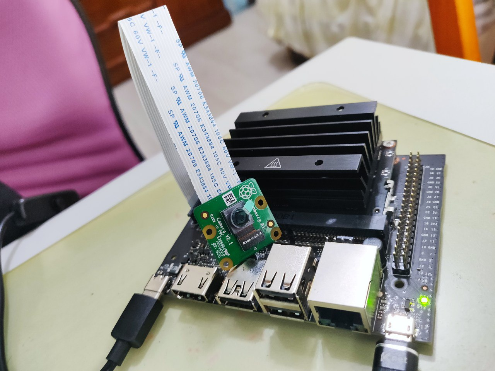

# Software Defined Video Streaming Homework for 2022-2 Network Lab
## Demo
[youtube](https://www.youtube.com/watch?v=1w_JFab4DJw)


## What is This


This is an intelligent video streaming application that allows users to change the video processing algorithm applied on the raw streaming video provided by the camera on Jetson Nano through gRPC on the fly, and show the processed video content on user's computer with RTMP in real-time.

## Required Devices
- computer
- Jetson Nano
- Raspberry Pi Camera V2



## How to Run
Download the code to your Jetson Nano
```
# on Jetson Nano
git clone https://github.com/dlccyes/netlab_sdvs.git
```

Install essential things
```
# on Jetson Nano
sudo apt install protobuf-compiler build-essential make
```

Install & Enable Nginx
```
./nginx/nginx-rtmp.sh
```

Run the server
```
# on Jetson Nano
python3 server.py --ip 0.0.0.0 --port 8080
```

Run the client
```
# on local computer
python3 client.py --ip <Jetson Nano IP> --port 8080 --mode 0
```

On your local computer, run this to have the video shown. 
```
# on local computer
ffplay -fflags nobuffer rtmp://<Jetson Nano IP>/rtmp/live
```


To change the real-time video processing algorithm, append `grey`, `hand`, `face` or `object` after
```
# on local computer
python3 client.py --ip <Jetson Nano IP> --port 8080 --mode
```

For example, to enable real-time face detection, do
```
# on local computer
python3 client.py --ip <Jetson Nano IP> --port 8080 --mode hand
```

To disable algorithm, do
```
# on local computer
python3 client.py --ip <Jetson Nano IP> --port 8080 --mode clear
```

## Troubleshooting
### `opening in BLOCKING MODE` Error
```
sudo systemctl restart nvargus-daemon
```

### `Streamer warning: Embedded video playback halted; module nvarguscamerasrc0 reported: CANCELLED` or Other Errors
Your Jetson Nano probably overheats. Turn it off, wait for a few minute, and turn back on.

## References
- <https://github.com/johnnylord/gRPC-with-protobuf>
- other Network Lab materials